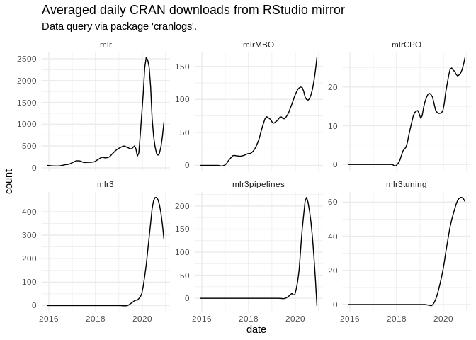
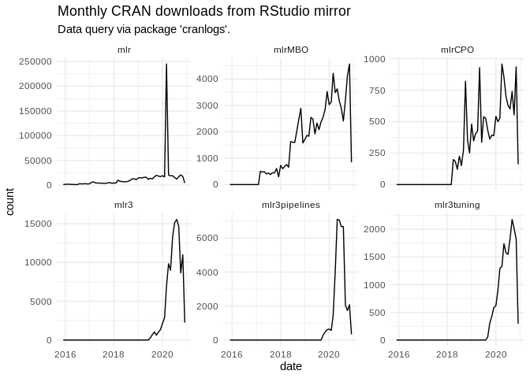
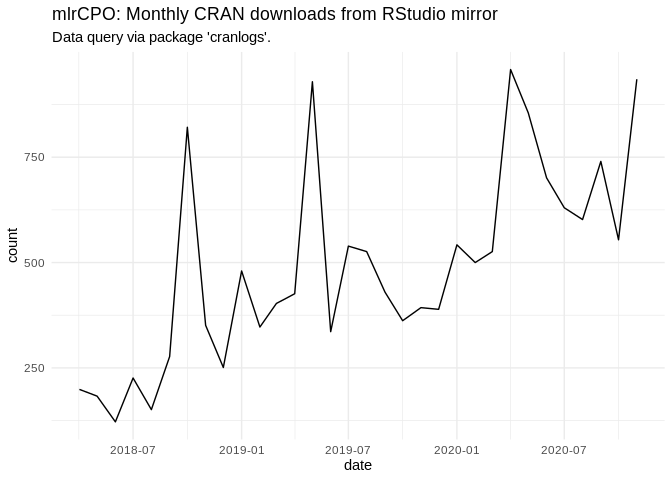
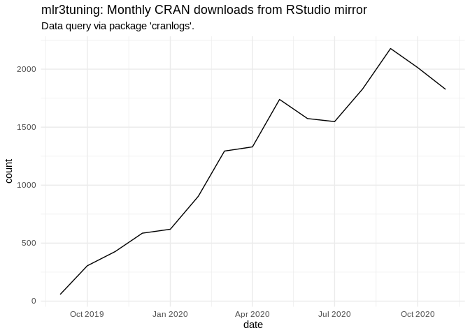

<!-- -->

<!-- -->

## Individual Plots for each package

<!-- --><!-- --><!-- --><!-- --><!-- --><!-- -->

Created on

    ## [1] "2020-10-13"

<details>

<summary>Session Info</summary>

``` r
sessionInfo()
```

    ## R version 4.0.2 (2020-06-22)
    ## Platform: x86_64-pc-linux-gnu (64-bit)
    ## Running under: Ubuntu 18.04.5 LTS
    ## 
    ## Matrix products: default
    ## BLAS:   /usr/lib/x86_64-linux-gnu/openblas/libblas.so.3
    ## LAPACK: /usr/lib/x86_64-linux-gnu/libopenblasp-r0.2.20.so
    ## 
    ## locale:
    ##  [1] LC_CTYPE=en_US.UTF-8       LC_NUMERIC=C              
    ##  [3] LC_TIME=en_US.UTF-8        LC_COLLATE=en_US.UTF-8    
    ##  [5] LC_MONETARY=en_US.UTF-8    LC_MESSAGES=en_US.UTF-8   
    ##  [7] LC_PAPER=en_US.UTF-8       LC_NAME=C                 
    ##  [9] LC_ADDRESS=C               LC_TELEPHONE=C            
    ## [11] LC_MEASUREMENT=en_US.UTF-8 LC_IDENTIFICATION=C       
    ## 
    ## attached base packages:
    ## [1] stats     graphics  grDevices utils     datasets  methods   base     
    ## 
    ## other attached packages:
    ## [1] lubridate_1.7.9 dplyr_1.0.2     ggplot2_3.3.2   magrittr_1.5   
    ## 
    ## loaded via a namespace (and not attached):
    ##  [1] Rcpp_1.0.5       compiler_4.0.2   pillar_1.4.6     git2r_0.27.1    
    ##  [5] tools_4.0.2      digest_0.6.25    lattice_0.20-41  nlme_3.1-148    
    ##  [9] jsonlite_1.7.1   evaluate_0.14    memoise_1.1.0    lifecycle_0.2.0 
    ## [13] tibble_3.0.4     gtable_0.3.0     mgcv_1.8-31      pkgconfig_2.0.3 
    ## [17] rlang_0.4.8      Matrix_1.2-18    cli_2.1.0        rstudioapi_0.11 
    ## [21] curl_4.3         yaml_2.2.1       xfun_0.16        httr_1.4.2      
    ## [25] withr_2.3.0      stringr_1.4.0    knitr_1.29       cranlogs_2.1.1  
    ## [29] generics_0.0.2   vctrs_0.3.4      askpass_1.1      grid_4.0.2      
    ## [33] tidyselect_1.1.0 glue_1.4.2       R6_2.4.1         fansi_0.4.1     
    ## [37] rmarkdown_2.4    farver_2.0.3     purrr_0.3.4      splines_4.0.2   
    ## [41] tic_0.9.0.9006   scales_1.1.1     ps_1.4.0         htmltools_0.5.0 
    ## [45] ellipsis_0.3.1   assertthat_0.2.1 colorspace_1.4-1 labeling_0.3    
    ## [49] stringi_1.4.6    openssl_1.4.3    munsell_0.5.0    crayon_1.3.4

</details>
