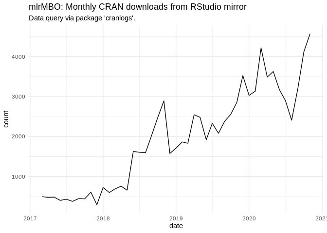
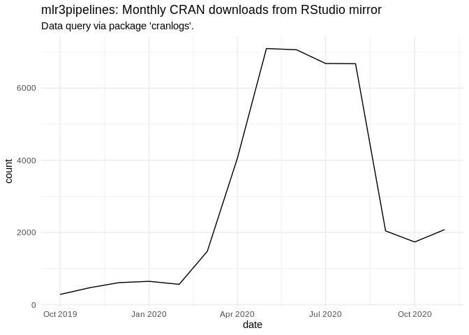

<!-- -->

<!-- -->

## Individual Plots for each package

<!-- --><!-- --><!-- --><!-- --><!-- --><!-- -->

Created on

    ## [1] "2019-11-22"

<details>

<summary>Session Info</summary>

``` r
sessionInfo()
```

    ## R version 3.6.1 (2017-01-27)
    ## Platform: x86_64-pc-linux-gnu (64-bit)
    ## Running under: Ubuntu 16.04.6 LTS
    ## 
    ## Matrix products: default
    ## BLAS:   /home/travis/R-bin/lib/R/lib/libRblas.so
    ## LAPACK: /home/travis/R-bin/lib/R/lib/libRlapack.so
    ## 
    ## locale:
    ##  [1] LC_CTYPE=en_US.UTF-8       LC_NUMERIC=C              
    ##  [3] LC_TIME=en_US.UTF-8        LC_COLLATE=en_US.UTF-8    
    ##  [5] LC_MONETARY=en_US.UTF-8    LC_MESSAGES=en_US.UTF-8   
    ##  [7] LC_PAPER=en_US.UTF-8       LC_NAME=C                 
    ##  [9] LC_ADDRESS=C               LC_TELEPHONE=C            
    ## [11] LC_MEASUREMENT=en_US.UTF-8 LC_IDENTIFICATION=C       
    ## 
    ## attached base packages:
    ## [1] stats     graphics  grDevices utils     datasets  methods   base     
    ## 
    ## other attached packages:
    ## [1] lubridate_1.7.4 dplyr_0.8.3     ggplot2_3.2.1   magrittr_1.5   
    ## 
    ## loaded via a namespace (and not attached):
    ##  [1] Rcpp_1.0.3       compiler_3.6.1   pillar_1.4.2     git2r_0.26.1    
    ##  [5] tools_3.6.1      digest_0.6.22    jsonlite_1.6     evaluate_0.14   
    ##  [9] memoise_1.1.0    lifecycle_0.1.0  tibble_2.1.3     gtable_0.3.0    
    ## [13] pkgconfig_2.0.3  rlang_0.4.2      cli_1.1.0        curl_4.2        
    ## [17] yaml_2.2.0       xfun_0.10        httr_1.4.1       withr_2.1.2     
    ## [21] stringr_1.4.0    knitr_1.25       askpass_1.1      cranlogs_2.1.1  
    ## [25] grid_3.6.1       tidyselect_0.2.5 glue_1.3.1       R6_2.4.1        
    ## [29] rmarkdown_1.17   farver_2.0.1     purrr_0.3.3      backports_1.1.5 
    ## [33] scales_1.1.0     tic_0.2.13.9021  htmltools_0.4.0  assertthat_0.2.1
    ## [37] colorspace_1.4-1 labeling_0.3     stringi_1.4.3    openssl_1.4.1   
    ## [41] lazyeval_0.2.2   munsell_0.5.0    crayon_1.3.4

</details>
